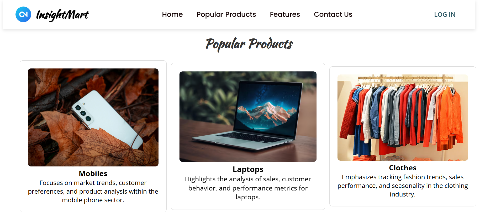
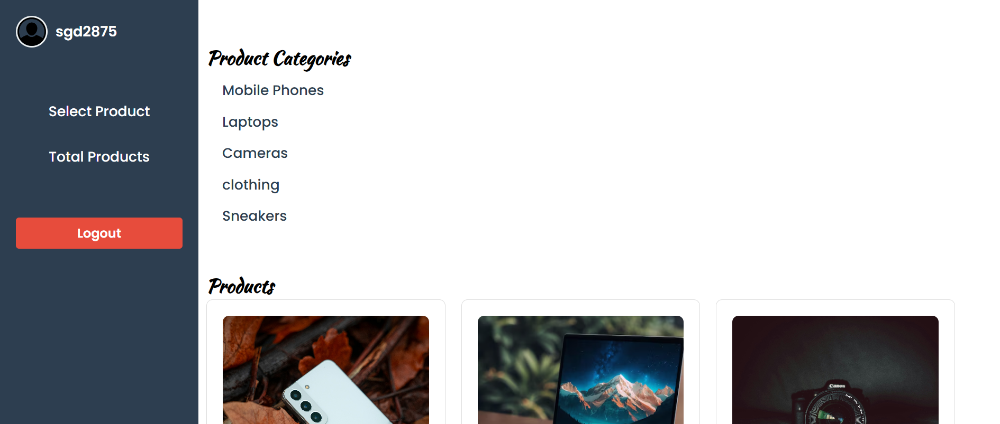
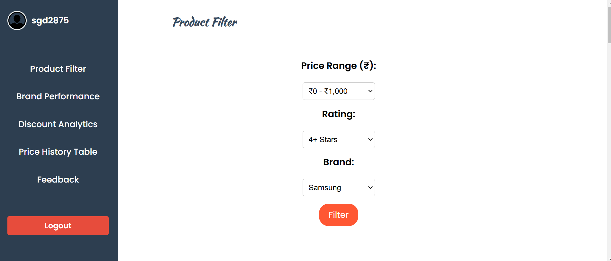
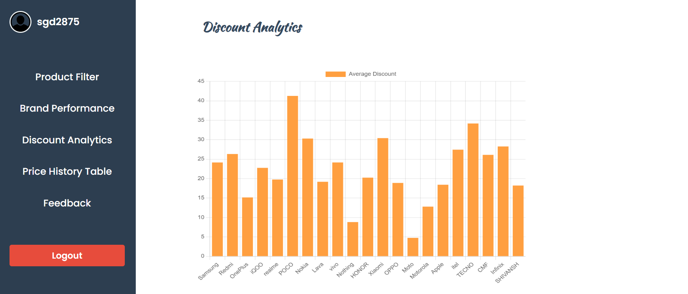

# 🛒 Amazon Product Analytics Dashboard

A Python-based data scraping and analytics dashboard for Amazon products, built with **BeautifulSoup**, **MySQL**, and **Flask (optional for visualization)**. It scrapes live product listings, stores them securely using design patterns, and enables analytics like discount insights, price tracking, and product filtering.

---

## 📌 Features

- ✅ Real-time scraping from Amazon (Mobile Phones, Laptops, Cameras, Clothing, Sneakers)
- ✅ Product price & rating extraction
- ✅ Discount analytics and top-rated product views
- ✅ Singleton pattern for secure database access
- ✅ Stored procedures, views, and triggers for data validation
- ✅ Multithreaded scraping for speed
- ✅ Factory Pattern for extensibility across multiple platforms

---

## 🛠️ Tech Stack

| Category         | Tools/Libraries                    |
|------------------|------------------------------------|
| Language         | Python 3                           |
| Scraping         | BeautifulSoup, urllib              |
| Database         | MySQL (with procedures, triggers)  |
| Design Patterns  | Singleton, Factory                 |
| Testing          | `unittest`, `MagicMock`, `patch`   |
| Multithreading   | `threading`                        |

---

## 📷 Screenshots

### 🏠 Homepage
> Displays analytics overview with top insights and stats.



---

### 📂 Product Categories
> Shows different categories like mobile phones, laptops, cameras, clothing, sneakers.



---

### 🔍 Product Filter
> Enables filtering based on brand, price range, rating, or discount.



---

### 📉 Discount Analytics
> Displays heavily discounted products and their percentage discounts.



---

## 🧠 Design Patterns Used

- **Singleton Pattern**: Ensures a single, consistent connection to MySQL throughout scraping.
- **Factory Pattern**: Enables easy extension to other platforms like Flipkart, eBay by instantiating appropriate scraper classes.

---

## 🚀 Getting Started

### ✅ Prerequisites

- Python 3.x
- MySQL Server
- Install required libraries:

```bash
pip install beautifulsoup4 mysql-connector-python
```
### MySQL Setup

1.Create a database
```sql
CREATE DATABASE ecommerce_analytics;
```

2.Update your script with your MySQL credentials:
```python
host = "127.0.0.1"
user = "root"
password = "your_mysql_password"
```

### Run the Scraper
 ```bash
python3 scrapecode.py
```

### Run Unit Tests
```bash
python3 -m unittest scrapecode.py
```

## Run Flask app
```bash
python3 app.py
```


## 👤 Author

**Dharanikaran S**  
🎓 B.Tech Information Technology         
🏫 SSN College of Engineering, Tamil Nadu  
📧 dharanikarans27@email.com  
🔗 [LinkedIn](https://www.linkedin.com/in/dharanikaran-s-229b55303/)  
🔗 [GitHub](https://github.com/DharanikaranS)

---

> © 2025 Dharanikaran S. All rights reserved.


